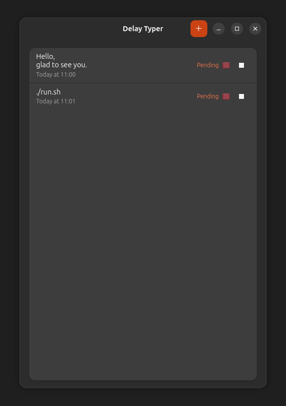
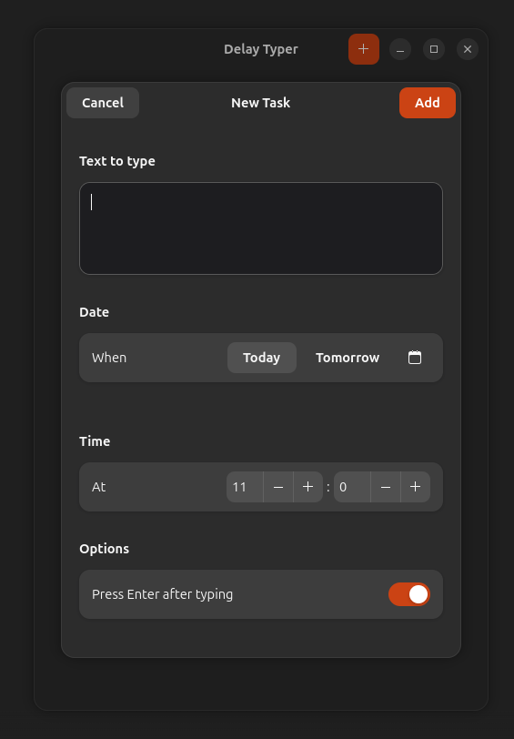
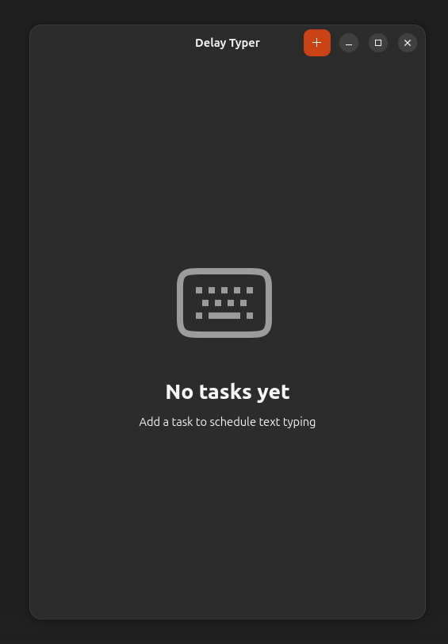

<div align="center">
  
  <h1>Delay Typer</h1>
  <p><strong>Schedule text to be automatically typed into any window, at any time you choose.</strong></p>
  <p>
    
    
    
    
    
  </p>
</div>

---

## Install (one command)

```bash
bash <(curl -fsSL https://raw.githubusercontent.com/tomsontomno/delay-typer/main/install.sh)
```

This installs all dependencies, sets up the desktop launcher, and adds a `delay-typer` command to your terminal.

> **Requires:** Ubuntu / Debian with Wayland (GNOME). Tested on Ubuntu 22.04+.

---

## What is Delay Typer?

Delay Typer is a native **GNOME desktop application** that lets you schedule text to be automatically typed into any focused window at a specific date and time.

**Real-world use cases:**
- Send a message at a precise moment without being at your computer
- Automate keyboard input for applications that don't support scripting
- Schedule form submissions, chat messages, or terminal commands
- Anything that needs "type this text, exactly at this time"

It runs **natively on Wayland** (including GNOME on Ubuntu, Fedora, etc.) using `/dev/uinput` directly — no X11 layer needed.

---

## Features

- **Scheduled typing** — pick a date and time, Delay Typer handles the rest
- **Multiple tasks** — queue as many typing tasks as you need, all run sequentially
- **Wayland-native** — works where `xdotool` and `wtype` fail on GNOME
- **Multiline text** — type paragraphs, not just single lines
- **Optional Enter key** — toggle whether Enter is pressed after the text
- **Smart date shortcuts** — Today / Tomorrow / custom calendar picker
- **Background operation** — closing the window keeps tasks scheduled and running
- **Single-instance** — re-launching focuses the existing window, no duplicates
- **No race conditions** — concurrent tasks are serialized via a thread lock
- **GNOME-native UI** — built with GTK4 + Libadwaita, follows your system theme

---

## Screenshots

| Task List | Add Task | Empty State |
|:-:|:-:|:-:|
|  |  |  |

---

## Manual Installation

If you prefer to install manually:

### 1. Install dependencies

```bash
sudo apt install python3 python3-gi python3-gi-cairo \
                 gir1.2-gtk-4.0 gir1.2-adw-1 \
                 python3-evdev wl-clipboard git
```

### 2. Clone the repo

```bash
git clone https://github.com/tomsontomno/delay-typer.git
cd delay-typer
```

### 3. Add yourself to the `input` group

```bash
sudo usermod -aG input $USER
# Log out and back in for this to take effect
```

### 4. Install the desktop launcher

```bash
cp data/autotyper.desktop ~/.local/share/applications/delay-typer.desktop
# Edit the Exec= line to point to the full path of run.py
update-desktop-database ~/.local/share/applications/
```

### 5. Run

```bash
python3 run.py
```

Or search **Delay Typer** in GNOME Activities.

---

## How it works

Wayland's security model blocks applications from injecting keyboard input via the virtual keyboard protocol. You've probably seen this error:

```
Compositor does not support the virtual keyboard protocol
```

Delay Typer works around this cleanly:

1. **Saves** your current clipboard
2. **Sets** the clipboard to the scheduled text via `wl-copy`
3. **Synthesizes** `Ctrl+V` directly via `/dev/uinput` (bypasses compositor)
4. **Optionally** synthesizes `Enter`
5. **Restores** the original clipboard

This works with any keyboard layout and supports full Unicode.

```
Task fires
    │
    ├─ Save clipboard        (wl-paste)
    ├─ Set clipboard to text (wl-copy)
    ├─ Synthesize Ctrl+V     (/dev/uinput)
    ├─ Synthesize Enter      (/dev/uinput, optional)
    └─ Restore clipboard     (wl-copy)
```

---

## Project structure

```
delay-typer/
├── run.py                  # Entry point
├── install.sh              # One-command installer
├── autotyper/
│   ├── main.py             # Adw.Application, app lifecycle
│   ├── window.py           # Main window, task list UI
│   ├── add_dialog.py       # Add-task modal dialog
│   ├── task_model.py       # TypingTask dataclass + TaskStore
│   ├── scheduler.py        # GLib-integrated background scheduler
│   └── typer.py            # Wayland typing engine (evdev + wl-clipboard)
└── data/
    ├── autotyper.desktop   # .desktop launcher template
    └── icons/
        └── io.github.delaytyper.png
```

---

## Usage

1. Open **Delay Typer** from GNOME Activities or run `delay-typer`
2. Click **+** (top right) to add a task
3. Enter your text (multiline supported)
4. Choose **Today**, **Tomorrow**, or pick a custom date
5. Set the **hour and minute**
6. Toggle **"Press Enter after typing"** if needed
7. Click **Add** — task appears in the list with a "Pending" badge
8. Close the window — app keeps running in background
9. At the scheduled time, text is typed into whatever window is focused

---

## Contributing

Pull requests are welcome. For major changes, open an issue first to discuss what you'd like to change.

---

## License

MIT — see [LICENSE](LICENSE) for details.
